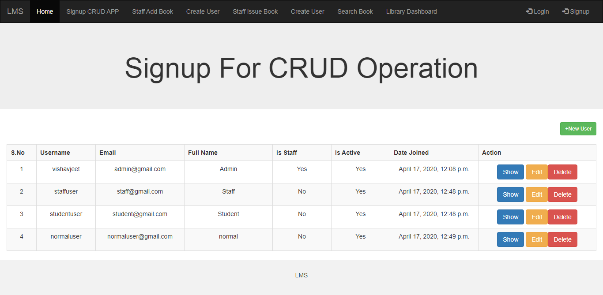

README file for Library Management System & CRUD opration for Signup

### USAGE, REQUIREMENTS and DEPLOYMENT

#1: Clone 
> git clone https://github.com/vishavjeet26/django-lms.git

#2: Change into project directory
>cd django-lms

#3: Make virtual environment
>virtualenv env

#4: Activate virtual environment
>env\Scripts\Activate

#5: Install requirements
>pip install -r requirements.txt

#6: Setup (if necessary)

#7: Start the development server
>python manage.py runserver

### Login Credentials for different types of users(Admin/Staff/Student/Normal)

## Admin User Credentials
User: vishavjeet
 
Password: 12345678

## Staff User(Librarian) Credentials

Username: staffuser
 
Password: jeet@123

## Student User (EndUser) Credentials
Username : studentuser
 
password:  jeet@123

Normal User
Username : normaluser 
 
password:  jeet@123

### Some Screenshot attached for frontend:

  

  

  

### If you want to explore and learn coding skills in Python
URL: http://www.python-ds.com/
